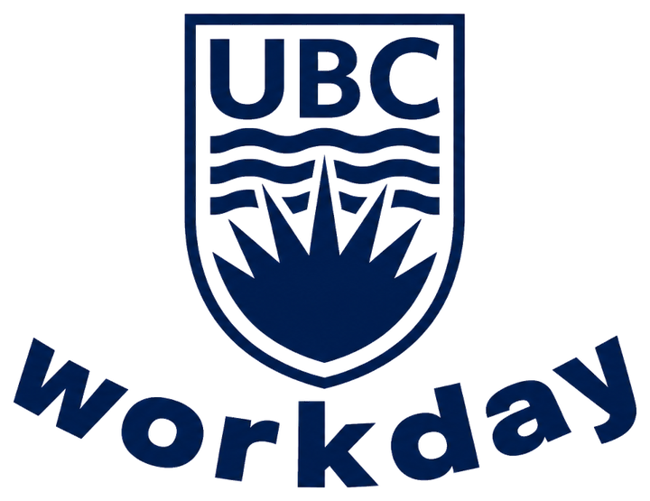
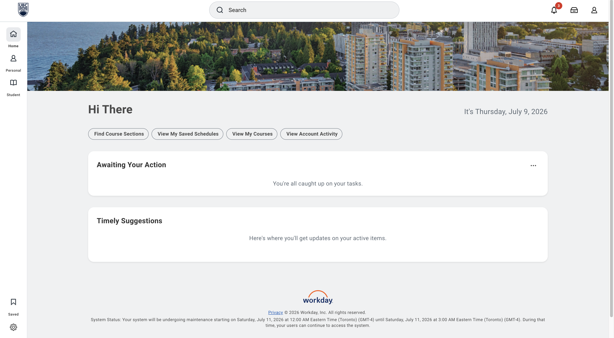
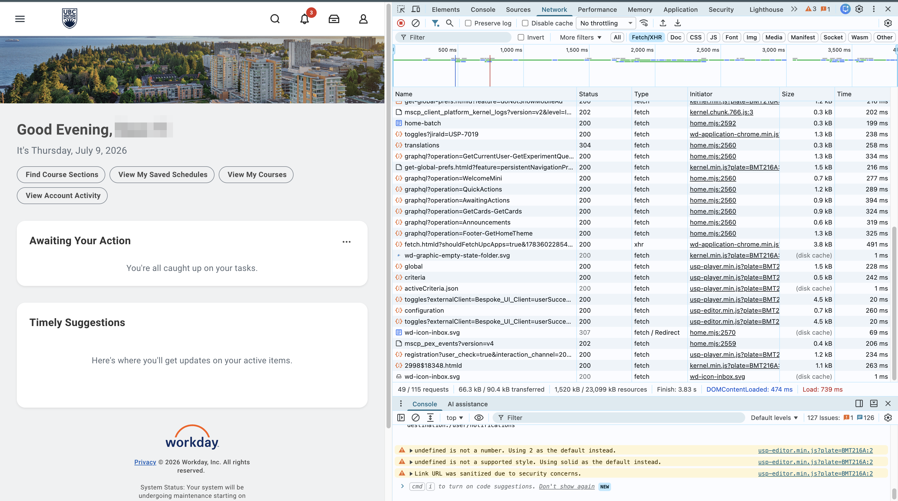
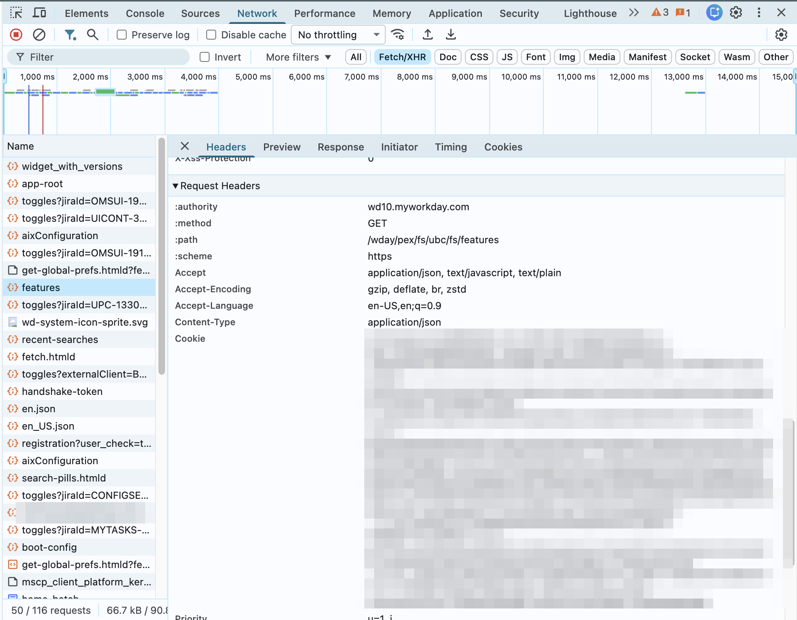

<p align="center">
  <picture>
    <source media="(prefers-color-scheme: dark)" srcset="docs/img/logo-dark.png">
    
  </picture>
</p>

<p align="center">
  <a href="LICENSE"></a>
  
  
</p>

# ubcworkday

An unofficial Python client for UBC's [Workday](https://myworkday.ubc.ca) student tenant.

## Description

`ubcworkday` wraps UBC's Workday web app in a small, typed Python API so you can pull your
academic data — grades, courses, schedules, degree progress, course-section search — without
clicking through the site. Authentication is just the session cookie from a logged-in browser;
every feature is exposed as a method on a `Student` facade whose names mirror the Workday menu
(`view_my_grades`, `find_course_sections`, `view_my_courses`, …).

## Getting Started

### Dependencies

* Python 3.11+
* [`httpx`](https://www.python-httpx.org)
* [`pydantic`](https://docs.pydantic.dev) v2
* A UBC Workday account and a current login cookie

### Installing

Clone the repository and install it into a virtual environment (dependencies come with it):

```bash
git clone https://github.com/yiseonwo/ubc-workday-api.git
cd ubc-workday-api

python3 -m venv .venv
source .venv/bin/activate

pip install -e .
```

### Configuring authentication

Workday's only credential is your browser session cookie:

1. Log in to [myworkday.ubc.ca](https://myworkday.ubc.ca) in your browser.

   

2. Open the developer tools (right-click → Inspect) → **Network** tab → click the
   **Fetch/XHR** filter → reload the page so the request list populates.

   

3. Click any request → **Headers** tab → scroll to **Request Headers** and copy the full
   value of the `Cookie` header.

   

4. Put it in a `.env` file at the project root (this file is git-ignored):

   ```
   COOKIE=<paste the entire cookie header here>
   ```

5. Load it into your environment before running (e.g. with `set -a; source .env; set +a`,
   or a tool like `python-dotenv`).

Cookies expire. When yours does, Workday serves its login page and the client raises
`SessionExpired` — copy a fresh cookie and try again.

### Executing program

```python
from ubcworkday import WorkdaySession, Student

with WorkdaySession() as session:
    me = Student(session)

    # Currently enrolled sections
    for section in me.view_my_courses():
        print(section)

    # Final grades for a term
    for course in me.view_my_grades(term="Winter Term 1"):
        print(course.course, course.grade, course.percentage)

    # Search course sections
    results = me.find_course_sections("CPSC 210", term="Winter Term 1")
    print(results)
```

Not every Workday menu item has a method: some (e.g. UBC Academic Calendar, UBC Official
Documents) are external links that leave Workday entirely, and a couple of flows aren't
built yet — Graduation and registration troubleshooting. The methods are organized into
packages mirroring Workday's menu sections — click one for details:

| Package | Covers |
| --- | --- |
| [Academic Records](ubcworkday/student/academic_records/README.md) | Enrollment record, final grades, degree progress |
| [Academic Planning](ubcworkday/student/academic_planning/README.md) | Degree audits against a program you choose |
| [Registration](ubcworkday/student/registration/README.md) | Course-section search, enrolled courses, saved schedules |
| [Contacts](ubcworkday/student/contacts/README.md) | Advisors and support contacts |
| [Graduation](ubcworkday/student/graduation/README.md) | Nothing yet (not built) |

Curious how the library talks to Workday under the hood (or want to add a flow)?
See the [client internals](ubcworkday/client/README.md).

Available `Student` methods — click a method for details (runnable examples and
sample JSON responses):

| Method | Returns |
| --- | --- |
| [`view_my_academic_record()`](ubcworkday/student/academic_records/README.md) | Full enrollment history |
| [`view_my_grades(term)`](ubcworkday/student/academic_records/README.md) | Final grades for a term |
| [`view_my_academic_progress()`](ubcworkday/student/academic_records/README.md) | Degree-requirement progress |
| [`find_course_sections(keyword, *, term, ...)`](ubcworkday/student/registration/README.md) | Course-section search results |
| [`view_my_courses()`](ubcworkday/student/registration/README.md) | Currently enrolled sections |
| [`view_my_saved_schedules()`](ubcworkday/student/registration/README.md) | Saved (planned) schedules |
| [`view_my_support_network()`](ubcworkday/student/contacts/README.md) | Advisors and support contacts |
| [`view_evaluated_academic_requirements(program)`](ubcworkday/student/academic_planning/README.md) | Evaluated requirement progress |
| [`evaluate_academic_requirements(program)`](ubcworkday/student/academic_planning/README.md) | None (evaluates academic requirements for the given program) |
| [`apply_for_program_completion()`](ubcworkday/student/graduation/README.md) | Raises `NotImplementedError` (not built) |
| [`troubleshoot_registration()`](ubcworkday/student/registration/README.md) | Raises `NotImplementedError` (not built) |

## Authors

Seonwoo Yi — [swyi1210@gmail.com](mailto:swyi1210@gmail.com)

## Version History

* 0.1
    * Initial release

## License

This project is licensed under the MIT License — see the [LICENSE](LICENSE) file for details.

## Acknowledgments

* README structure based on [DomPizzie's template](https://gist.github.com/DomPizzie/7a5ff55ffa9081f2de27c315f5018afc)

## Disclaimer

This is an **unofficial** project and is not affiliated with, endorsed by, or supported by
the University of British Columbia or Workday, Inc. It automates access to your own account
using your own credentials — use it in accordance with UBC's acceptable-use policies.
