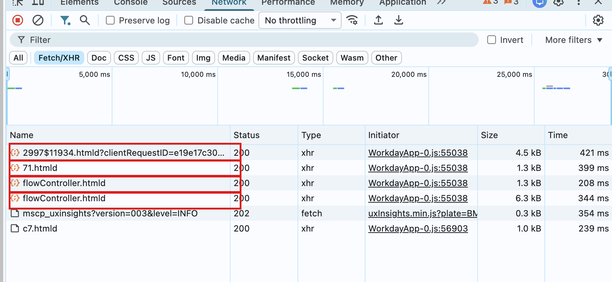
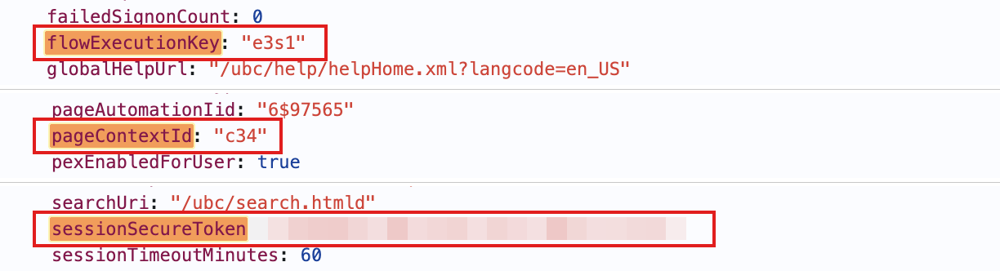
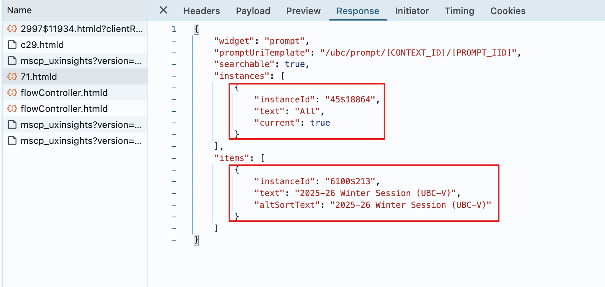
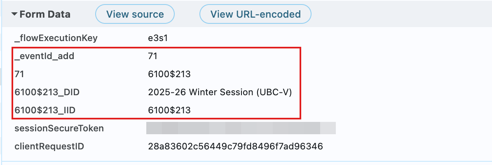
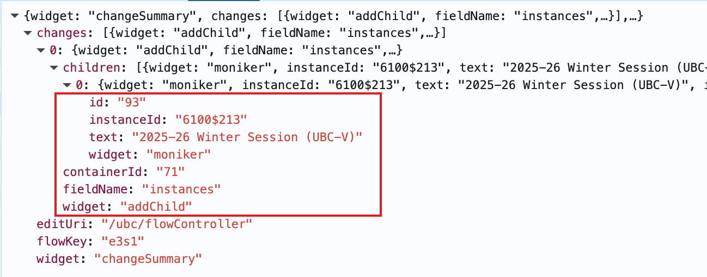
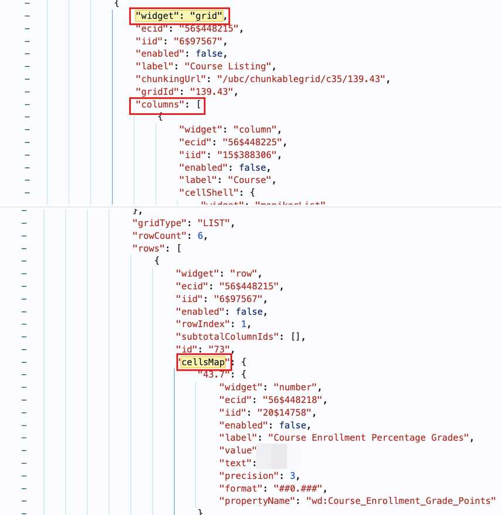
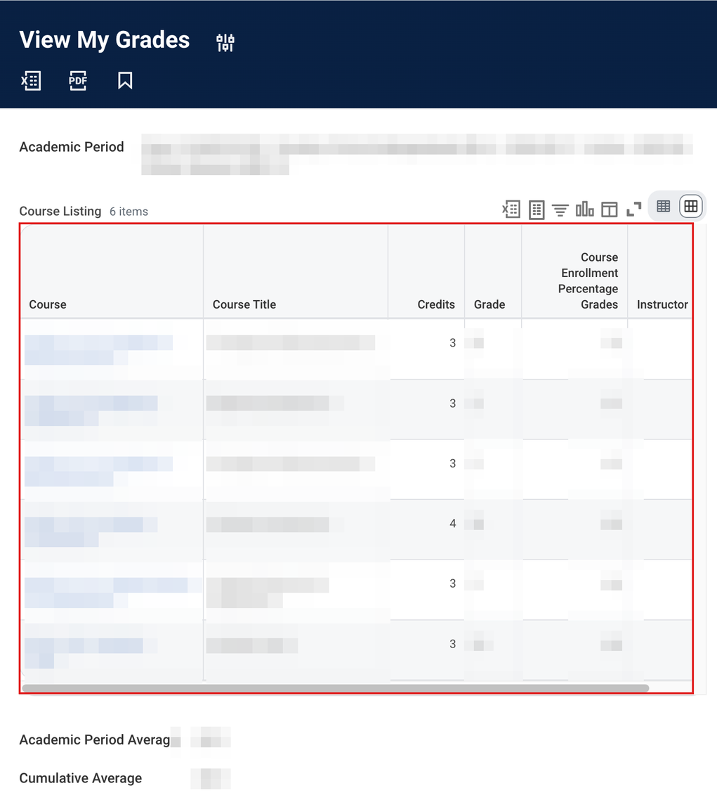

# Client

This package is the engine of the library. Workday doesn't offer an official way for
programs to ask it for data, so this package does the next best thing: it sends the same
web requests your browser sends when you click around Workday — just from Python instead.
Nothing student-specific lives here; features like `view_my_grades` (in
[`student/`](../student)) are built by combining the pieces in this folder.

## Description

Talking to Workday has two halves — asking and reading — and the files are split the
same way:

- [`endpoints/`](endpoints/README.md) — **how to ask.** Knows the web addresses (URLs)
  to call and how to fill in each request.
- [`response.py`](response.py) — **how to read.** Knows how to dig useful data out of
  what Workday sends back.
- [`session.py`](session.py) — **the messenger.** Every request in the library goes
  through one method, `WorkdaySession.send()`. It attaches your login cookie, sends the
  request, and turns anything that goes wrong into a clear Python error.

Module by module:

| Module | What it does |
| --- | --- |
| [`session.py`](session.py) | `WorkdaySession` — holds your login and sends every request (`send()`) |
| [`auth.py`](auth.py) | `WorkdayAuth` — your browser cookie (the only credential) and how we notice it expired |
| [`endpoints/task.py`](endpoints/task.py) | `TASK` — opens a Workday page; the first request of every feature |
| [`endpoints/prompt.py`](endpoints/prompt.py) | `OPTIONS` — asks a dropdown for its list of options |
| [`endpoints/flow.py`](endpoints/flow.py) | `ACTION` — fills in and submits the form (add / remove / validate / submit) |
| [`endpoints/faceted.py`](endpoints/faceted.py) | `Search` / `Replace` / `Pagination` — talks to search-results pages |
| [`response.py`](response.py) | `Page`, `Tokens`, `Choice`, `Grid`/`Row` — the shapes Workday data comes in, and helpers to find them |
| [`exceptions.py`](exceptions.py) | The errors this library can raise |

## How it works

When your browser opens a Workday page, it doesn't receive a normal web page. It
receives *JSON* — structured text — describing every label, table, dropdown, and button
on the screen. Workday calls each of those pieces a **widget**.

Doing something interactive, like picking a term and viewing grades, is a short
back-and-forth conversation: your browser sends one request per step, and Workday
remembers where in the form you are between steps. You can watch this conversation
yourself — open your browser's developer tools, switch to the **Network** tab, and click
through any Workday task:



The four boxed requests are one complete conversation. The [Example](#example) below
repeats it in Python, one step at a time.

> Numbers like `2997$11934` are Workday's internal names for pages and form fields in
> UBC's system. They stay the same until UBC reconfigures a page. Each feature keeps its
> numbers in one small dataclass (e.g. `GradesIds`), so if UBC ever changes one, the fix
> is one line.

When something goes wrong, the library raises an error. All of them share one parent,
`WorkdayError`, so `except WorkdayError` catches everything:

| Error | What it means |
| --- | --- |
| `SessionExpired` | Your cookie is missing or expired — Workday showed its login page instead of data |
| `WorkdayRequestError` | The request itself failed — bad connection, server error, or a reply that wasn't JSON |
| `OptionNotFound` | The term/program/level name you gave matched nothing — the error lists the valid names |
| `SubmitRejected` | Workday understood the request but refused it (like a form validation error) |

## Example

### `View My Grades`

### 1. Open the task — `2997$11934.htmld`

Everything starts by opening the page — the Python version of clicking **View My
Grades** in the menu:

```python
from ubcworkday.client.endpoints import TASK
from ubcworkday.client.response import Tokens

page = session.send(TASK, task_id="2997$11934")  # GET /ubc/task/2997$11934.htmld
tokens = Tokens.from_page(page)
```

The reply contains three **tokens** — short codes we must echo back on every later
request, so Workday knows it's still the same person filling in the same form:
`sessionSecureToken` (proves who you are), `flowExecutionKey` (identifies this run of
the form), and `pageContextId` (identifies the page). Here they are in the actual reply:



### 2. Fetch the field's options — `71.htmld`

The grades page has one dropdown: *Academic Period* (which term you want). Workday's
word for "give me this dropdown's options" is a **prompt**, and `71` is that dropdown's
internal id:

```python
from ubcworkday.client.endpoints import OPTIONS
from ubcworkday.client.response import find_choices, pick

page = session.send(
    OPTIONS,
    data=OPTIONS.body("71", tokens),
    context_id=tokens.context_id,
    field_id="71",
)
period = pick(find_choices(page), "Winter Term 1")  # Choice(id=..., text=...)
```

The reply lists the options. Each one has an internal id plus the text you'd see on
screen — the library calls that pair a `Choice`:



`pick` finds the first option whose text contains your words (capitalization doesn't
matter). If nothing matches, it raises `OptionNotFound` — and the error message lists
the names that do exist.

### 3. Fill the field — `flowController.htmld`

Choosing a value in the dropdown means sending an **add** event. Every form edit in
Workday goes to the same URL, `flowController.htmld` — a key in the body named
`_eventId_*` says what you're doing (`add`, `remove`, `validate`, or `submit`):

```python
from ubcworkday.client.endpoints import ACTION

session.send(ACTION, data=ACTION.add_body("71", period, tokens))
```

This is what `ACTION.add_body` actually sends — the chosen period's id filed under the
dropdown's id, plus the tokens from step 1:



Workday answers by echoing the change back — confirmation that the dropdown now holds
your chosen period:



### 4. Submit and read the grid — `flowController.htmld` again

Submitting (event `77` on this page) ends the conversation, and the reply *is* the
results page — the same widget JSON your browser would turn into the grades screen:

```python
from ubcworkday.client.response import find_grids

page = session.send(ACTION, data=ACTION.submit_body("77", tokens))
rows = [row for grid in find_grids(page) for row in grid.rows if "Grade" in row]
```

Tables arrive as **grid** widgets: `columns` names the column headers, and each row's
`cellsMap` holds the values:



`find_grids` collects every table on the page into `Grid` objects. Each row is a `Row` —
a dictionary you read by column name, with safe helpers like `row.text("Grade")` and
`row.number("Credits")` that return `None` instead of crashing when a cell is empty.
Feature packages then turn rows into pydantic models — that's where the raw protocol
ends and normal Python objects begin. And rendered by the browser, that same grid is the
page you know:



Not every flow ends at submit: course-section search keeps talking to the results page —
searching, filtering, loading the next page. That family is covered in the
[endpoints README](endpoints/README.md).
