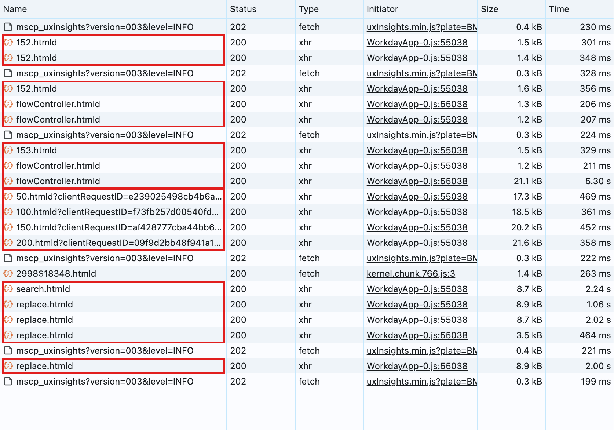
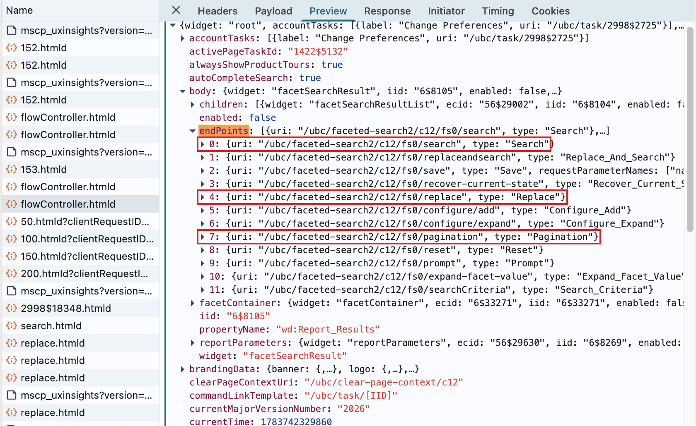

# Endpoints

An **endpoint** is one kind of request you can send Workday: a web address (URL) plus
the data that goes with it. This folder only *builds* requests — reading the replies is
[`response.py`](../response.py)'s job, and sending is `WorkdaySession.send()`'s job.
Endpoints are grouped by what they do in the conversation (open a page, ask a dropdown,
edit a form, browse results), not by technical request type.

## Description

The families:

| Module | Endpoints | What it does |
| --- | --- | --- |
| [`base.py`](base.py) | `Endpoint`, `Get`, `Post` | The shared skeleton: a URL with `{blanks}` to fill in, sent as GET or POST |
| [`task.py`](task.py) | `TASK` | Opens a Workday page — the first request of every feature |
| [`prompt.py`](prompt.py) | `OPTIONS` | Asks a dropdown for its list of options |
| [`flow.py`](flow.py) | `ACTION` | Fills in and submits the form (add / remove / validate / submit) |
| [`faceted.py`](faceted.py) | `Search`, `Replace`, `Pagination` | Talks to a search-results page: keyword search, filters, next page |

To see these pieces working together in a real feature, read the
[worked example](../README.md#example) in the client README.

## How it works

An `Endpoint` ([`base.py`](base.py)) is just a URL with `{blanks}` in it — `send()`
fills in the blanks each time. `Get` and `Post` fix whether it's sent as a GET (asking
for a page) or a POST (submitting form data). On that base, each family adds its own
kind of request:

### `Task` — opening a page ([`task.py`](task.py))

`GET /ubc/task/{task_id}.htmld` — the Python version of clicking a menu item. The reply
is the opened form, along with the tokens that every later request must carry.

```python
from ubcworkday.client.endpoints import TASK

page = session.send(TASK, task_id="2997$11934")
```

### `Options` — dropdowns ([`prompt.py`](prompt.py))

`POST /ubc/prompt/{context_id}/{field_id}.htmld` — asks one form field for its options
(Workday calls this a **prompt**). A plain call returns a flat list. Some pickers are
layered — for example the term picker goes *Future → school year → term* — and you drill
down one layer per request by passing `prompt_id` (the option you just picked) and
`filters` (extra values the next layer needs; `find_next_level` reads them off the
previous reply).

```python
from ubcworkday.client.endpoints import OPTIONS

page = session.send(
    OPTIONS,
    data=OPTIONS.body("71", tokens),
    context_id=tokens.context_id,
    field_id="71",
)
```

### `Action` — editing the form ([`flow.py`](flow.py))

`POST /ubc/flowController.htmld` — every form edit goes to this one URL. A key in the
body named `_eventId_*` says which action you mean, and there's one builder per action:

| Builder | Action | Used for |
| --- | --- | --- |
| `add_body(field, choice, tokens)` | `add` | Put a chosen option into a field |
| `remove_body(field, instance_id, tokens)` | `remove` | Clear a value out of a field |
| `check_body(field, tokens)` | `validate` | Tick a checkbox / set a yes-no field |
| `submit_body(event_id, tokens)` | `submit` | Submit the form — finishes the flow |

### `Search` / `Replace` / `Pagination` — search results ([`faceted.py`](faceted.py))

The odd family out: these three have **no fixed URL**. Every search-results page
includes a list called `endPoints` — the URLs to use for your *next* move (search again,
change filters, load more). So these endpoints are built from the page you're on:
`from_page()` finds the entry matching the class's `TYPE` and takes its URL. Each new
results page brings fresh URLs that replace the old ones — which is why
[`find_course_sections.py`](../../student/registration/find_course_sections.py) always
keeps the latest page in `self._page`.

## Example

### `Find Course Sections`

Find Course Sections is the feature that uses the search-results family. It starts
exactly like the grades example — open the page, fill in the form (term into field
`152`, level into field `153`, submit event `156`) — but the reply is a search-results
page that you keep interacting with:



That reply lists the URLs for every next move in its `endPoints` list — `Search`,
`Replace`, and `Pagination` each find their own entry by `type`:



From there, each interaction is one `send()` on an endpoint built from the current page.
Searching within the results:

```python
from ubcworkday.client.endpoints import Search

page = session.send(Search.from_page(page), data=Search.body("CPSC 210", tokens))
```

`Replace.from_page(page)` works the same way for changing filters, and
`Pagination.from_page(page)` loads the next page of results — its URL gets an `{offset}`
filled in per request, which is exactly the `50/100/150/200.htmld` run you can see in
the request list above.
