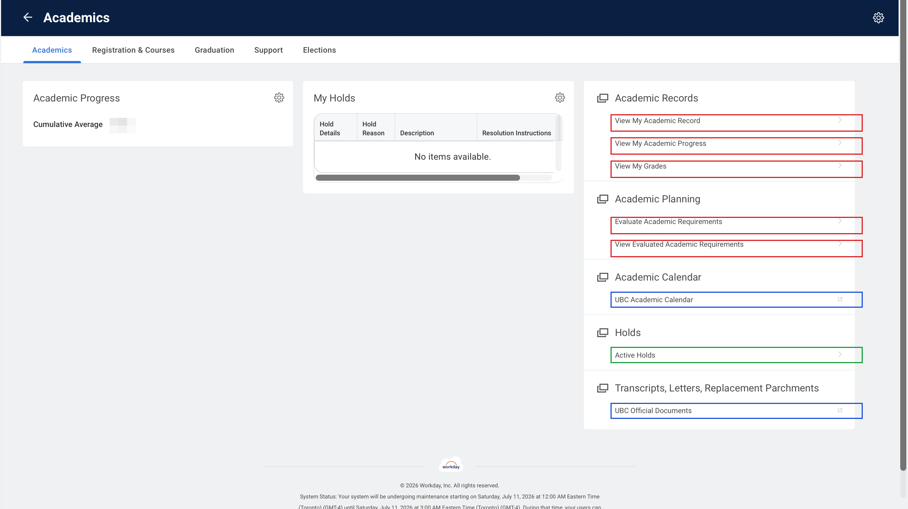

# Academic Planning

Degree audits: view your requirement progress against a declared program, or run a
what-if evaluation against any program in the catalog. Mirrors the **Academic Planning**
menu in Workday.

> Methods return pydantic models; the JSON below is what `result.model_dump()` looks like (samples are illustrative).

## Methods available



> 🟥 available as a method · 🟦 external link (leaves Workday) · 🟩 no method yet

| Method |
| --- |
| `view_evaluated_academic_requirements(program)` |
| `evaluate_academic_requirements(program)` |
| `list_declared_programs(session)` |
| `list_offered_programs(session)` |

## `view_evaluated_academic_requirements(program)`

```python
from ubcworkday import WorkdaySession, Student

with WorkdaySession() as session:
    student = Student(session)
    progress = student.view_evaluated_academic_requirements("Bachelor of Science")

print(progress.model_dump())
```

Returns `AcademicProgress`:

```json
{
  "credits_defined": 120,
  "credits_in_progress": 12,
  "credits_satisfying": 78,
  "remaining": "30 Credits",
  "status": "In Progress",
  "requirements": [
    {"name": "Communication Requirement", "status": "Satisfied", "remaining": null},
    {"name": "Upper-level Credits", "status": "Not Satisfied", "remaining": "18 Credits"}
  ]
}
```

### `list_declared_programs(session)` — values for `program`

Your declared programs:

```python
from ubcworkday import WorkdaySession
from ubcworkday.student.academic_planning.view_evaluated_academic_requirements import list_declared_programs

with WorkdaySession() as session:
    programs = list_declared_programs(session)

print(programs)
```

Returns `list[str]`:

```json
["Bachelor of Science"]
```

## `evaluate_academic_requirements(program)`

```python
from ubcworkday import WorkdaySession, Student

with WorkdaySession() as session:
    student = Student(session)
    student.evaluate_academic_requirements("Major in Computer Science")
```

Returns nothing. It evaluates the academic requirements of the given program and saves
the result to your account — Workday delivers the finished report to your notifications
on the website. Raises `SubmitRejected` if Workday rejects the submit.

### `list_offered_programs(session)` — values for `program`

Every program UBC offers (~1100):

```python
from ubcworkday import WorkdaySession
from ubcworkday.student.academic_planning.evaluate_academic_requirements import list_offered_programs

with WorkdaySession() as session:
    programs = list_offered_programs(session)

print(programs)
```

Returns `list[str]`:

```json
["Bachelor of Science", "Major in Computer Science", "Minor in Data Science"]
```
