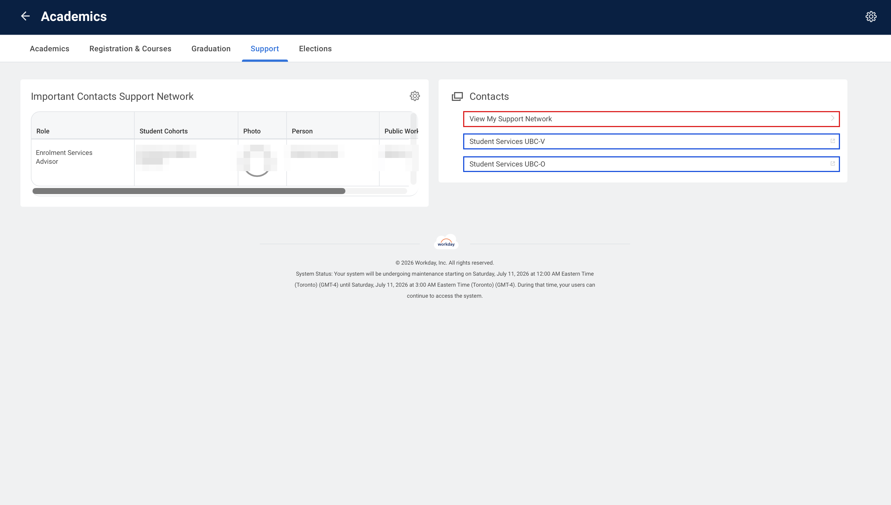

# Contacts

Your support network: advisors and other people attached to your student record.
Mirrors the **Contacts** menu in Workday.

> Methods return pydantic models; the JSON below is what `result.model_dump()` looks like (samples are illustrative).

## Methods available



> 🟥 available as a method · 🟦 external link (leaves Workday) · 🟩 no method yet

| Method |
| --- |
| `view_my_support_network()` |

## `view_my_support_network()`

```python
from ubcworkday import WorkdaySession, Student

with WorkdaySession() as session:
    student = Student(session)
    contacts = student.view_my_support_network()

print([c.model_dump() for c in contacts])
```

Returns `list[SupportContact]`:

```json
[
  {
    "name": "Jane Advisor",
    "role": "Academic Advisor",
    "email": "jane.advisor@ubc.ca",
    "cohorts": ["Science Year 2"]
  }
]
```
