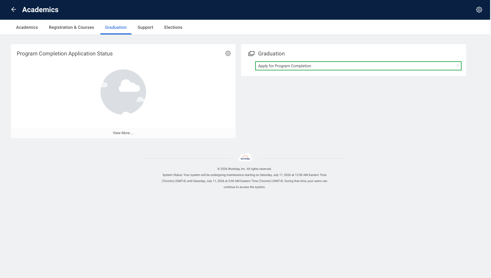

# Graduation

Graduation-related flows. Mirrors the **Graduation** menu in Workday.

Nothing works yet: `Student.apply_for_program_completion()` exists but always raises
`NotImplementedError`. It would file a real graduation application (task `2997$10409`),
and the flow was never captured because the account used to build the library isn't
eligible to graduate.

> 🟥 available as a method · 🟦 external link (leaves Workday) · 🟩 no method yet
