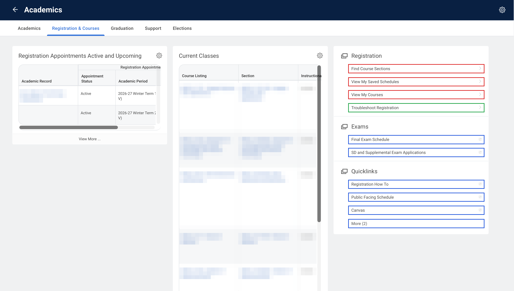

# Registration

Course discovery and your enrollment state: search the section catalog, see what you're
enrolled in, and read your saved (planned) schedules. Mirrors the **Registration &
Courses** menu in Workday.

> Methods return pydantic models; the JSON below is what `result.model_dump()` looks like (samples are illustrative).

## Methods available



> 🟥 available as a method · 🟦 external link (leaves Workday) · 🟩 no method yet

| Method |
| --- |
| `find_course_sections(keyword, *, term, ...)` |
| `view_my_courses()` |
| `view_my_saved_schedules()` |
| `list_terms(session, period)` |
| `list_levels(session)` |

## `find_course_sections(keyword, *, term, level="Undergraduate", period="Future")`

```python
from ubcworkday import WorkdaySession, Student

with WorkdaySession() as session:
    student = Student(session)
    results = student.find_course_sections("CPSC 210", term="Winter Term 1")

print(results.model_dump())
```

Returns `Results` — the first page of matching sections:

```json
{
  "total": 12,
  "offset": 0,
  "size": 12,
  "sections": [
    {
      "id": "1$123456",
      "code": "CPSC_V 210-101",
      "name": "Software Construction",
      "format": "Lecture",
      "status": "Open",
      "delivery_mode": "In Person",
      "credits": 4.0,
      "enrolled": 180,
      "capacity": 220,
      "waitlisted": 0,
      "waitlist_capacity": 40,
      "meetings": [
        {
          "raw": "UBC-V | Mon Wed Fri | 10:00 a.m. - 11:00 a.m. | 2025-09-02 - 2025-12-04 | SWNG 121",
          "campus": "UBC-V",
          "location": "SWNG 121",
          "days": "Mon Wed Fri",
          "time": "10:00 a.m. - 11:00 a.m.",
          "dates": "2025-09-02 - 2025-12-04"
        }
      ]
    }
  ]
}
```

### `list_terms(session, period="Future")` — values for `term`

```python
from ubcworkday import WorkdaySession
from ubcworkday.student.registration.find_course_sections import list_terms

with WorkdaySession() as session:
    terms = list_terms(session)

print(terms)
```

Returns `list[str]`:

```json
["2025-26 Winter Term 1 (UBC-V)", "2025-26 Winter Term 2 (UBC-V)"]
```

### `list_levels(session)` — values for `level`

```python
from ubcworkday import WorkdaySession
from ubcworkday.student.registration.find_course_sections import list_levels

with WorkdaySession() as session:
    levels = list_levels(session)

print(levels)
```

Returns `list[str]`:

```json
["Undergraduate", "Graduate"]
```

## `view_my_courses()`

```python
from ubcworkday import WorkdaySession, Student

with WorkdaySession() as session:
    student = Student(session)
    sections = student.view_my_courses()

print([s.model_dump() for s in sections])
```

Returns `list[EnrolledSection]` — your currently enrolled sections:

```json
[
  {
    "course": "CPSC_V 210 - Software Construction",
    "section": "CPSC_V 210-101",
    "status": "Registered",
    "credits": 4.0,
    "grading_basis": "Graded",
    "instructional_format": "Lecture",
    "delivery_mode": "In Person",
    "meetings": ["2025-09-02 - 2025-12-04 | Mon Wed Fri | 10:00 a.m. - 11:00 a.m. | SWNG-Floor 1-Room 121"],
    "start_date": "2025-09-02",
    "end_date": "2025-12-04"
  }
]
```

## `view_my_saved_schedules()`

```python
from ubcworkday import WorkdaySession, Student

with WorkdaySession() as session:
    student = Student(session)
    schedules = student.view_my_saved_schedules()

print([s.model_dump() for s in schedules])
```

Returns `list[SavedSchedule]`:

```json
[
  {
    "term": "2025-26 Winter Term 1 (UBC-V)",
    "courses": ["CPSC_V 210-101", "MATH_V 200-102", "STAT_V 251-201"],
    "alerts": 1
  }
]
```
